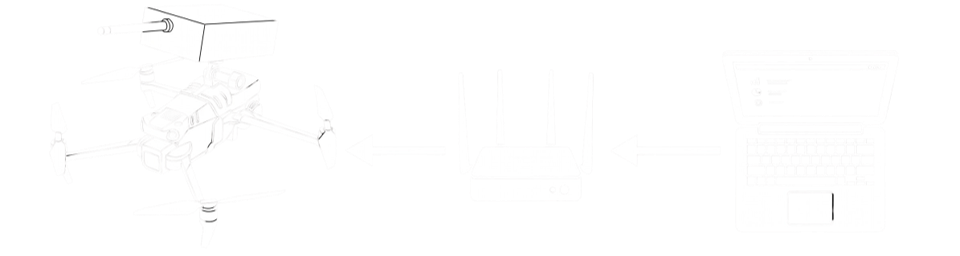
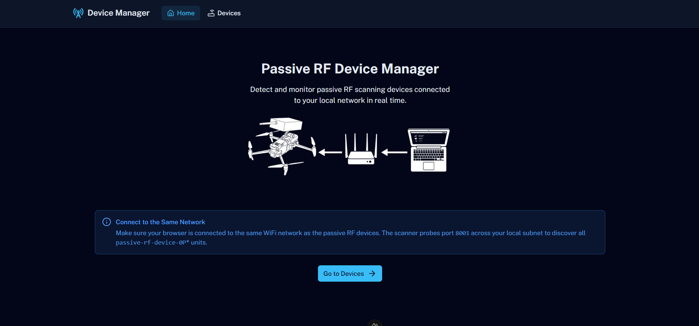

# <div align="center">Passive RF Device Manager</div>

<div align="center">

Detect and monitor passive RF scanning devices connected to your local network in real time. These devices are **GSM/UMTS/LTE cellular signal scanners** that broadcast their presence via HTTP on port 8001 with hostname prefix `passive-rf-device-0P*`.

This application helps you discover and manage these RF monitoring devices across your local subnet.

[](https://ui.nuxt.com)
[](https://vuejs.org)
[](https://typescriptlang.org)
[](https://tailwindcss.com)
[](LICENSE)
[](https://pnpm.io)

</div>

<p align="center">
  
</p>

<p align="center">
  <a href="https://muhammad-yunus.github.io/Cellular-Discovery-Device-Manager/" target="_blank">
    
  </a>
</p>

## Project Structure

```
project/
├── app/                          # Nuxt application source
│   ├── assets/css/               # Global styles & Tailwind config
│   │   └── main.css
│   ├── components/               # Vue components
│   │   └── DeviceCard.vue        # Individual device card display
│   ├── composables/              # Composables (business logic)
│   │   └── useDevices.ts         # Device scanning & polling logic
│   ├── pages/                    # Nuxt pages
│   │   ├── index.vue             # Home page
│   │   └── devices.vue           # Device discovery page
│   ├── app.config.ts             # Nuxt UI theme config
│   └── app.vue                   # Root layout component
├── public/                       # Static assets
│   └── favicon.svg               # App favicon (Radio Tower icon)
├── nuxt.config.ts                # Nuxt configuration
├── package.json
├── tsconfig.json
└── eslint.config.mjs
```

## Architecture

```
┌─────────────────────────────────────────────────────────┐
│                     Browser (Client)                    │
│                                                         │
│  ┌───────────┐    ┌───────────┐  ┌────────────────┐     │
│  │   Home    │    │  Devices  │  │ DeviceCard     │     │
│  │   Page    │    │   Page    │  │ (per device)   │     │
│  └─────┬─────┘    └─────┬─────┘  └──────┬─────────┘     │
│        │                │               │               │
│        └────────────────┴───────────────┘               │
│                         │                               │
│              ┌──────────▼──────────┐                    │
│              │    useDevices()     │                    │
│              │  - Subnet scanning  │                    │
│              │  - Auto-polling     │                    │
│              │  - Device detection │                    │
│              └──────────┬──────────┘                    │
└─────────────────────────┼───────────────────────────────┘
                          │ HTTP GET /api/v1/device/status
                          │ (Port 8001, CORS enabled)
                          │
┌─────────────────────────▼──────────────────────────────┐
│          Passive RF Device (GSM/UMTS/LTE Scanner)      │
│  Hostname: passive-rf-device-0P{last_octet}            │
│  Example: passive-rf-device-0P10                       │
│                                                        │
│  Endpoints:                                            │
│  - GET /api/v1/device/status  → JSON device info       │
│  - GET /api/v1/device/config  → JSON device config     │
│                                                        │
│  Ports: 8001 (HTTP), 8002 (HTTPS)                      │
└────────────────────────────────────────────────────────┘
```

### Key Components

| Component | Purpose |
|-----------|---------|
| `UHeader` | Navigation bar with logo, nav links, and color mode toggle |
| `DeviceCard` | Displays individual device status, IP, and online state |
| `useDevices` | Core logic: subnet scanning, polling, device discovery |

### Scanning Process

1. User enters or confirms subnet base (default: `192.168.1`)
2. App probes each IP on port 8001 sequentially in batches
3. Responsive devices are added to the discovered list
4. Auto-polling refreshes device status every 10 seconds

<p align="center">
  
</p>

## How to Build & Run

### Prerequisites

- Node.js 18+ 
- pnpm 8+

### Install Dependencies

```bash
pnpm install
```

### Development Server

```bash
pnpm dev
```

Open http://localhost:3000 in your browser.

### Production Build

```bash
pnpm build
pnpm preview
```

## Deployment to GitHub Pages

### Prerequisites

- Push to the `main` branch (CI/CD runs automatically)
- GitHub Pages enabled in repository settings (`Settings > Pages > Source: GitHub Actions`)

### Manual Deploy

```bash
gh run trigger deploy.yml
```

Or use the GitHub Actions workflow directly:

```bash
gh workflow run deploy.yml
```

### Build Output

The app is deployed as a subdirectory on GitHub Pages:
- **URL**: `https://muhammad-yunus.github.io/Cellular-Discovery-Device-Manager/`
- **Build command**: `pnpm build`
- **Output directory**: `.output/public/`

### GitHub Actions Workflow

Automated deployment runs on every push to `main`:
1. Install dependencies (`pnpm install`)
2. Run type checks (`pnpm typecheck`)
3. Run linter (`pnpm lint`)
4. Build for production (`pnpm build`)
5. Upload GitHub Pages artifact
6. Deploy to `muhammad-yunus.github.io/Cellular-Discovery-Device-Manager/`

## License

MIT License - see [LICENSE](LICENSE) file for details.
